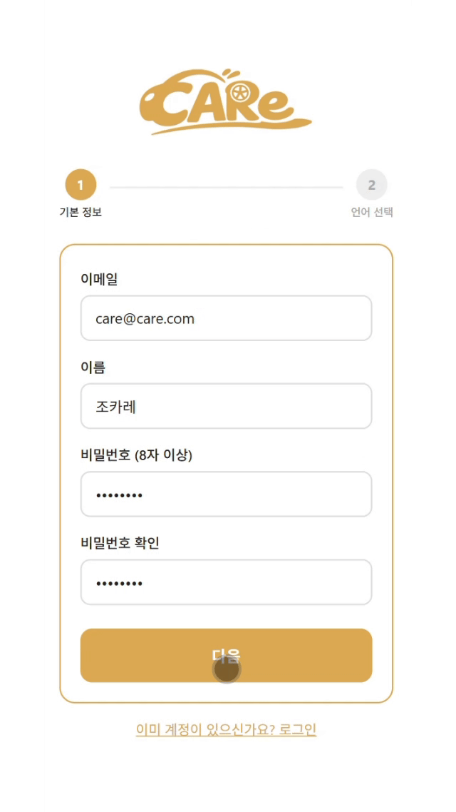
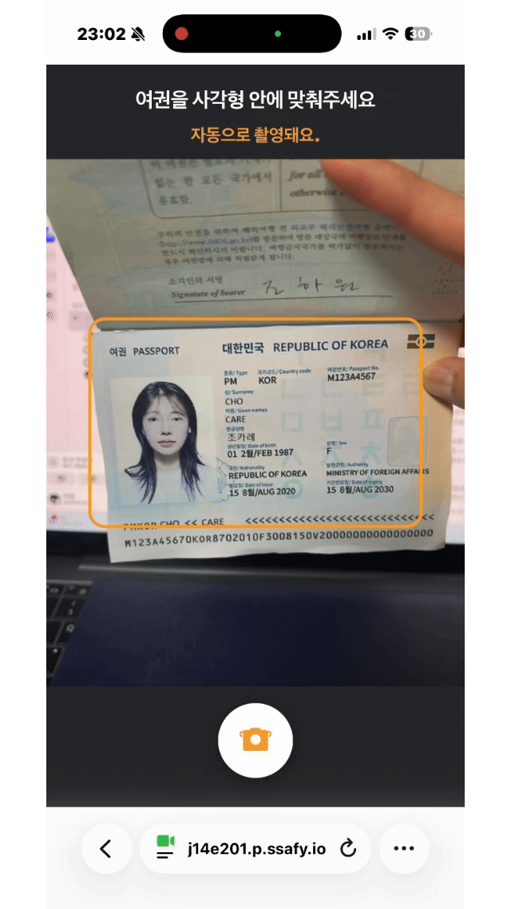
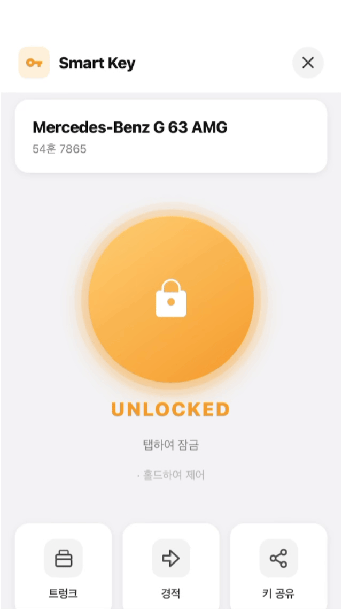

# ✨ CARe

<div align="center">

**해외 여행자를 위한 블록체인 기반 스마트 차량 렌탈 서비스**


CARe는 AI 신분증 인증, 얼굴 인식, YOLO 기반 흠집 탐지, 스마트 컨트랙트 자동 정산을 결합한  
렌터카 서비스입니다. 렌터(사용자)와 업체 모두를 위한 듀얼 플랫폼으로 구성되어 있습니다.
**개발 기간** : (추후 업데이트 예정)  
**플랫폼** : Web (PWA) & Blockchain & AI  
**개발 인원** : 6명
**기관** : 삼성 청년 SW·AI 아카데미 14기

</div>

---

# 🔎 목차

- [🧑‍💻 팀 구성](#-팀-구성)
- [🛠️ 기술 스택](#️-기술-스택)
- [🎯 주요 기능](#-주요-기능)
- [🌐 아키텍처 구조](#-아키텍처-구조)
- [📁 프로젝트 디렉토리 구조](#-프로젝트-디렉토리-구조)
- [📦 프로젝트 산출물](#-프로젝트-산출물)

---

# 🧑‍💻 팀 구성

> 팀 구성 정보는 추후 업데이트 예정입니다.

---

# 🛠️ 기술 스택

### 🍃 Backend

         

| 구분 | 사용 기술 |
|------|----------|
| Language | Java 17 |
| Framework | Spring Boot 3.5.0 |
| Library | Spring Data JPA, Spring Data Redis, Spring Security, Spring WebSocket, Spring Validation, Spring Dotenv, Lombok, JJWT 0.11.5, Springdoc OpenAPI 2.8.0 |
| Blockchain | Web3j 4.12.2 (Polygon Amoy / SSAFY 블록체인) |
| Storage | AWS SDK S3 2.25.6 + CloudFront |
| Build Tool | Gradle |
| Features | JWT 인증, 소셜 로그인 연동(Privy), 차량/예약/정산 서비스 로직, SSE 실시간 알림, 스마트 컨트랙트 자동 정산, AI 서버 연동 |

---

### 🖥️ Frontend — Renter (렌터용 PWA)

        

| 구분 | 사용 기술 |
|------|----------|
| Language | JavaScript (JSX) |
| Framework | React 19, Vite 7 |
| 라우팅 | React Router DOM 7 |
| 블록체인/지갑 | ethers.js 6, @privy-io/react-auth 3.17.0 |
| AI/ML | @huggingface/transformers 3.8.1 |
| 국제화 | i18next 25, react-i18next 16 (ko/en/ja/zh/fr) |
| 통신 | Axios, @microsoft/fetch-event-source (SSE) |
| PWA | vite-plugin-pwa 0.21.0 |
| 주요 기능 | 소셜 로그인, 신분증 OCR 스캔, 얼굴 인식 본인확인, YOLO 흠집 탐지, 스마트키, DID 인증, 분쟁 정산 |

---

### 🖥️ Frontend — Company (업체용)

    

| 구분 | 사용 기술 |
|------|----------|
| Language | JavaScript (JSX) |
| Framework | React 18, Vite 5 |
| 3D | Three.js 0.162.0 |
| 라우팅 | React Router DOM 6 |
| 통신 | Axios, @microsoft/fetch-event-source (SSE) |
| 주요 기능 | 차량 등록/관리, 예약 현황, AI 반납 리포트, 분쟁 처리, 대시보드 |

---

### 🤖 AI 서버

     

| 구분 | 사용 기술 |
|------|----------|
| Language | Python 3.11 |
| Framework | FastAPI, Uvicorn |
| 얼굴 인식 | DeepFace (FaceNet512) |
| 흠집 탐지 | Ultralytics YOLOv8 (GPU 전용 서버) |
| 흠집 비교 | ResNet50 v3 (특징 벡터 비교) |
| OCR | 신분증(면허증/여권) 텍스트 추출 |
| Storage | AWS S3 (이미지 저장), Pinata (IPFS 무결성 증명) |

#### AI 서버 구성

| 서버 | 포트 | 역할 | 인프라 |
|------|------|------|--------|
| ai-verify | 8001 | 얼굴 인식, OCR, 흠집 비교 | EC2 Docker |
| ai-yolo | 8000 | YOLOv8 흠집 탐지 (WebSocket) | 외부 GPU 서버 (RunPod 등) |

---

### ⛓️ Blockchain

    

| 구분 | 사용 기술 |
|------|----------|
| 언어 | Solidity |
| 개발 도구 | Hardhat, Hardhat Ignition |
| 네트워크 | SSAFY 블록체인 (Polygon Amoy 기반, Chain ID: 31221) |
| 지갑 | Privy (임베디드 지갑, 소셜 로그인 연동) |
| IPFS | Pinata (흠집 이미지 무결성 증명) |
| 컨트랙트 | CareToken (ERC-20), CarNFT, DIDRegistry, DisputeSettlement |

---

### 💾 Database & Infra

        

| 구분 | 사용 기술 |
|------|----------|
| RDBMS | MySQL 8.0 |
| Cache | Redis 7-alpine |
| OS | Ubuntu 22.04.5 LTS |
| Container | Docker, Docker Compose |
| CI/CD | Jenkins (Blue-Green 무중단 배포) |
| Reverse Proxy | Nginx (SSL, SSE 지원) |
| Cloud | AWS EC2, AWS S3, AWS CloudFront |

---

# 🎯 주요 기능

### 📱 렌터 (사용자)

---

**1. 회원가입 / 로그인**

소셜 로그인(Google, Apple 등) 또는 이메일 인증으로 가입합니다.  
최초 1회 신분증(면허증 또는 여권)을 촬영하면 OCR로 정보가 자동 추출됩니다.

|  |  |  |
|:---:|:---:|:---:|
| **회원가입** | **면허증 스캔** | **여권 스캔** |

---

**2. 차량 예약**

국가 / 날짜 / 차종으로 차량을 검색하고, CARE 토큰으로 스마트 컨트랙트를 체결해 예약합니다.

|  |
|:---:|
| **차량 예약** |

---

**3. 차량 픽업**

얼굴 인식 AI로 본인을 확인하고, 스마트키로 차량 잠금을 해제합니다.  
픽업 전 차량 6면을 촬영하면 YOLO AI가 흠집을 자동 탐지하고 블록체인에 기록합니다.

|  |  |  |
|:---:|:---:|:---:|
| **얼굴 인식** | **스마트키** | **흠집 탐지** |

---

**4. 차량 반납**

반납 전 차량 6면을 재촬영하면 AI가 픽업 전후 흠집 이미지를 비교합니다.  
반납 리포트가 생성되어 업체에 전달되고, 분쟁 발생 시 증거를 제출하여 스마트 컨트랙트로 자동 정산합니다.

|  |  |  |  |
|:---:|:---:|:---:|:---:|
| **차량 반납** | **반납 리포트** | **증거 제출** | **합의 후 정산** |

---

### 💻 업체 (Company)

| 기능 | 설명 |
|------|------|
| 차량 등록/관리 | 차량 NFT 발행, 보험 설정, 차량 목록 관리 |
| 예약 현황 | 실시간 예약 목록 및 상세 정보 확인 |
| AI 반납 리포트 | 픽업/반납 흠집 비교 결과 및 IPFS 증거 확인 |
| 분쟁 처리 | 렌터 증거 검토 후 합의/정산 진행 |
| 대시보드 | 차량별 통계 및 현황 모니터링 |

---

# 🌐 아키텍처 구조

> 아키텍처 다이어그램은 추후 업데이트 예정입니다.

```
[Renter PWA]  [Company Web]
      │               │
      └──────┬────────┘
             ↓
          [Nginx]
      ┌────────────────────────────────┐
      │  /api/      → Backend          │
      │  /ai/face/  → ai-verify        │
      │  /ai/ocr/   → ai-verify        │
      │  /ai/ws/    → ai-yolo (GPU)    │
      │  /privy/    → privy-server     │
      │  /jenkins/  → Jenkins          │
      └────────────────────────────────┘
             ↓
     [Spring Boot Backend]
      ├── MySQL 8
      ├── Redis 7
      ├── SSAFY Blockchain (Web3j)
      └── AWS S3 + CloudFront
```

---

# 📁 프로젝트 디렉토리 구조

<details>
<summary>🍃 Backend</summary>

```
backend/src/main/java/com/care/
├── CareApplication.java
├── domain/
│   ├── auth/
│   │   ├── controller/       AuthController.java
│   │   ├── controller/dto/   LoginRequest / CompanySignUpRequest / RenterSignUpRequest
│   │   │                     TokenResponse
│   │   └── service/          AuthService.java
│   │
│   ├── car/
│   │   ├── controller/       CarController.java
│   │   ├── controller/dto/   CarRegisterRequest / CarReviewRequest
│   │   │                     CarDetailResponse / CarListResponse / ReturnReportResponse
│   │   ├── entity/           OwnedCar / CarModel / CarImage / CarSize
│   │   ├── event/            CarRegisteredEvent / CarEventListener
│   │   ├── exception/        CarErrorCode.java
│   │   ├── repository/       OwnedCarRepository / CarModelRepository / CarImageRepository
│   │   └── service/          CarService.java
│   │
│   ├── company/
│   │   ├── controller/       CompanyController / CompanyCarController / InsuranceController
│   │   ├── controller/dto/   BizVerifyRequest / CompanyProfileResponse
│   │   │                     InsuranceResponse / CompanyNotificationResponse
│   │   ├── entity/           Company / Insurance / CompanyNotification
│   │   ├── exception/        CompanyErrorCode.java
│   │   ├── repository/       CompanyRepository / InsuranceRepository / CompanyNotificationRepository
│   │   └── service/          CompanyService / InsuranceService / CompanyNotificationService
│   │
│   ├── renter/
│   │   ├── controller/       RenterController.java
│   │   ├── controller/dto/   DocumentVerifyRequest / TokenChargeRequest / WalletUpdateRequest
│   │   │                     DocumentVerifyResponse / RenterProfileResponse / TokenChargeResponse
│   │   ├── entity/           Renter / RenterDocument / RenterNotification
│   │   ├── exception/        RenterErrorCode.java
│   │   ├── repository/       RenterDocumentRepository / RenterNotificationRepository
│   │   └── service/          RenterService (추정)
│   │
│   ├── reservation/
│   │   └── (예약 생성/조회/취소 로직)
│   │
│   └── scan/
│       └── (흠집 스캔 결과 처리 로직)
│
└── global/
    ├── config/
    ├── exception/
    ├── filter/
    └── utils/
```

</details>

<details>
<summary>📱 Frontend — Renter</summary>

```
renter/src/
├── App.jsx
├── main.jsx
├── i18n.js
│
├── api/
│   ├── auth.js / faceVerify.js / ocr.js
│   ├── reservation.js / scan.js
│
├── assets/
│
├── components/
│   ├── BottomNav / BottomSheet
│   ├── DatePickerModal / NotificationToast
│
├── context/
│   ├── AuthContext.jsx / NotificationContext.jsx
│
├── locales/
│   └── ko.json / en.json / ja.json / zh.json / fr.json
│
└── pages/
    ├── auth/          LoginPage / SignUpPage / ForgotPassword / ResetPassword
    ├── home/          홈 화면
    ├── landing/       랜딩 페이지
    ├── language/      언어 선택
    ├── splash/        스플래시 화면
    ├── wallet/        지갑 관리
    ├── payment/       결제
    ├── car-list/      차량 목록
    ├── car-detail/    차량 상세
    ├── car-faceauth/  얼굴 인식 본인확인
    ├── car-smartkey/  스마트키
    ├── car-return/    차량 반납
    ├── car-report/    AI 반납 리포트
    ├── scan/          흠집 탐지 촬영
    ├── damage-detail/ 흠집 상세
    ├── damage-history/흠집 이력
    ├── did-auth/      DID 인증
    ├── dispute/       분쟁 처리
    ├── reservations/  예약 목록
    ├── booking-complete/ 예약 완료
    ├── my-car/        내 차량
    ├── profile/       프로필
    └── notifications/ 알림
```

</details>

<details>
<summary>💻 Frontend — Company</summary>

```
company/src/
├── App.jsx
├── main.jsx
├── i18n.js
│
├── components/
│   ├── ConfirmModal / NFTModal
│   ├── ReservationList / ReservationTable
│   ├── Sidebar / StatCard / TabFilter
│   └── ProtectedRoute
│
├── locales/
│   └── ko.json / ja.json
│
└── pages/
    ├── login/           로그인
    ├── dashboard/       대시보드
    ├── car-management/  차량 관리
    ├── car-register/    차량 등록
    ├── car-detail/      차량 상세
    ├── ai-report/       AI 반납 리포트
    └── dispute/         분쟁 처리
```

</details>

<details>
<summary>🤖 AI Server</summary>

```
ai/
├── verify/                      # EC2 배포 (Face, OCR, Scratch Compare)
│   ├── app/
│   │   ├── api/routes/          document.py / face.py / scratch_compare.py / health.py
│   │   ├── models/
│   │   │   ├── deepface/        verifier.py (FaceNet512)
│   │   │   ├── ocr/             extractor.py
│   │   │   └── resnet50_v3/     feature_extractor.py / preprocessing.py
│   │   ├── services/
│   │   │   ├── face_service.py / ocr_service.py
│   │   │   └── scratch_comparison_service.py
│   │   ├── schemas/             face.py / document.py / scratch.py
│   │   └── main.py
│   ├── requirements.txt
│   └── Dockerfile
│
└── yolo/                        # GPU 서버 전용 (Scratch Detection, WebSocket)
    ├── app/
    │   ├── api/routes/          scratches.py / health.py
    │   ├── services/            detect_service.py / s3_service.py / ipfs_service.py
    │   └── main.py
    ├── requirements.txt
    └── Dockerfile
```

</details>

<details>
<summary>⛓️ Blockchain</summary>

```
blockchain/
├── contracts/
│   ├── CareToken.sol            # CARE ERC-20 토큰 (보증금/정산 통화)
│   ├── CarNFT.sol               # 차량 NFT
│   ├── DIDRegistry.sol          # DID 온체인 등록/관리
│   └── DisputeSettlement.sol    # 분쟁 정산 합의 기록
├── ignition/modules/            # Hardhat Ignition 배포 모듈
├── scripts/
│   ├── deploy_car_nft.js
│   ├── faucet.js                # CARE 토큰 초기 지급
│   └── check_balance.js
├── hardhat.config.js
└── package.json
```

</details>

<details>
<summary>🏗️ Infra</summary>

```
infra/
├── docker-compose.yml           # 프로덕션 인프라 (Nginx, MySQL, Redis, Privy)
├── docker-compose-local.yml     # 로컬 개발용
└── nginx/
    └── nginx.conf               # Blue-Green placeholder 포함

Jenkinsfile                      # CI/CD Pipeline (Blue-Green 무중단 배포)
```

</details>

---

# 📦 프로젝트 산출물

**📹 Video Portfolio**

[영상 포트폴리오](https://youtu.be/p3fs4m-h9Bw?si=KIqtkicPyjpTqwwz)

---


**🗄️ ERD**
<details>
<summary>자세히</summary>

</details>

---

