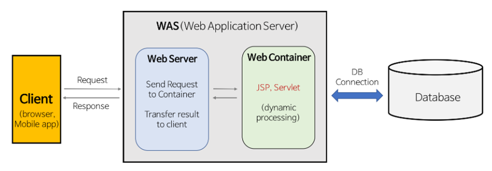

# [TIL] 2026-02-26

## 📋 오늘 한 일
- 담당자 정하기
- 아이디어 구체화
- AI 과제 제출

## 💡 새롭게 배운 점

### Http 통신의 특징
- Hyper Text Transper Protocol의 약자 (데이터를 대부분 text로 주고 받음)
- 웹 서비스에서 Client – Server 간의 정보를 요청(request) / 응답(response)받기 위해 만들어진 프로토콜
- Client가 요청이 있을 때만, Server에서 응답을 반환 (단 방향 통신)
- Statefuless protocol - Server가 Client의 상태를 저장하지 않음 (데이터 1회 요청 시 Connect / Close 반복) 
- 반드시 DB(레디스 등 메모리 DB 포함)를 거쳐 데이터를 주고 받음
- 서버 자체의 메모리에 유저 데이터를 들고 있지 않음

### Http 통신의 예시

### Socket 통신의 특징

- 패킷이라는 형식화된 데이터 메모리 단위를 주고 받아 통신함
- Client와 Server가 특정 port를 열어서 실시간으로 양방향 통신을 하는 방식
- Stateful Protocol - Server가 Client의 상태를 저장하고 있음 (Client / Server 측에서 임의로 연결상태를 끊지 않는 한 서로 연결 유지)
- DB를 통해 데이터를 주고 받을 수도 있고, 임시로 데이터를 서버 프로그램 자체 내에서 생성해서 가지고 있을 수도 있음 
- 서버 자체의 메모리에 유저 데이터를 저장하고 있음

### 소켓 (Socket)이란?

- 소켓은 네트워크 상에서 돌아가는 두개의 프로그램 (Client – Server) 간의 접속 점 
- Client 측의 소켓 연결 요청 - Server 간의 소켓 연결 수락이 이루어지면 양방향으로 데이터 전송 가능 

### 결론

- Http 통신은 웹브라우저와 웹서버간 단방향 통신 프로토콜 
- Http 통신은 대규모 및 비동기 통신에 적합
- 웹 통신에서 양방향으로 통신하기 위해 WebSocket, WebRTC 등의 기술 등장
- Socket 통신은 웹이 아닌 프로그램에서 Client와 Server가 양방향으로 통신 가능한 방식 
- Socket 통신은 실시간 통신 및 임시 데이터 저장이 필요한 곳에 사용 (실시간 동영상 스트리밍, 임베디드 통신(콜택시 단말기 등), MMORPG, 온라인 게임 등…)

## 🚀 고민한 점 & 해결 과정 (Challenges & Insights)

### 고민
- 틀에 박히지 않고 뭔가 흥미가 가는 아이디어가 뭐가 있을까?

### 해결
- 해결하지 못했습니다. 브레인스토밍을 더 해야 할 듯 하다.

## 📅 주말에 할 일
- 새로운 주제 생각하기